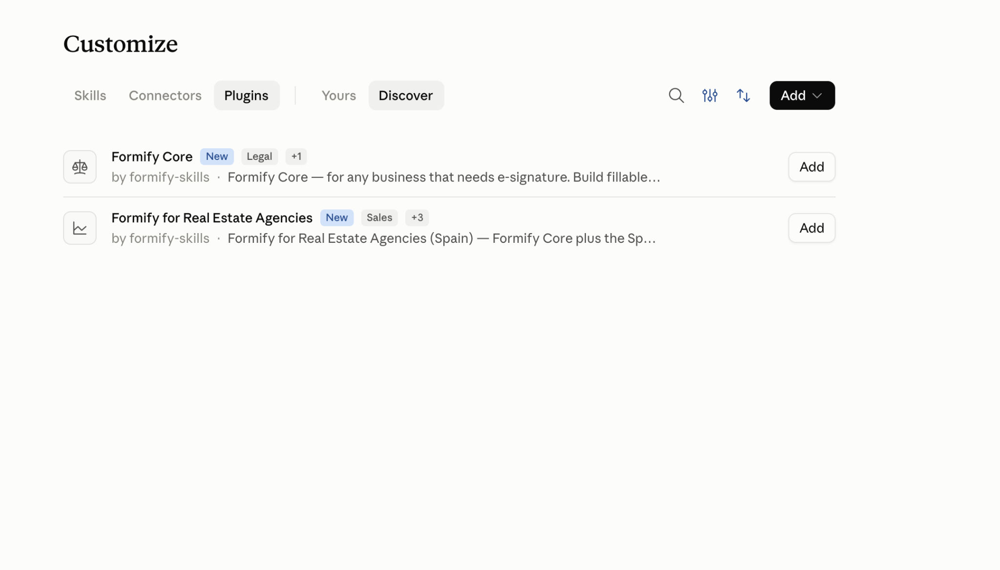

# Formify Skills

[](https://glama.ai/mcp/connectors/eu.formify.mcp/formify) [](https://smithery.ai/server/formify-e-sign/formify-mcp)

**Ask an AI assistant to get something signed, and it knows how.**

These are agent skills for [Formify](https://formify.eu) — electronic signatures and
identity verification. Install them once, and your assistant can build a contract or a
fillable form, place the signature fields where they belong, send it to the right people,
verify who signed with BankID or an ID scan, and chase the ones who have not.

You can also send an AI assistant along **inside the document itself**. The person receiving
your contract can ask it what a clause means and it highlights the passage it is answering
about, reads it aloud if they prefer, and answers in English, Swedish or Spanish — so nobody
has to paste your contract into another chatbot to understand what they are signing.

You do not need to be technical, and you never learn a command. You describe what you want
signed and by whom; everything below is what the assistant handles for you.

Works with Claude Desktop, the Codex desktop app, Claude Code, Codex CLI, ChatGPT, Grok,
Manus, Cursor and around twenty other agents.

## Contents

**Install**

- [Claude Desktop and claude.ai](#install-in-claude-desktop) — three steps, recorded
- [Codex Desktop](#install-in-codex-desktop) — two steps, recorded
- [Claude Code and Codex CLI](#install-in-claude-code-or-codex-cli) — two commands
- [Every other app](#every-other-app) — ChatGPT, Grok, Manus, and any agent
- [Try it](#try-it)

**What it does**

- [Why this exists](#why-this-exists)
- [The skills](#the-skills)
- [What you can ask for](#what-you-can-ask-for)
- [What the agent can actually do](#what-the-agent-can-actually-do)
- [The whole process, not one document](#the-whole-process-not-one-document)

**Reference**

- [Connect the Formify MCP server](#connect-the-formify-mcp-server)
- [What is in this repository](#what-is-in-this-repository)
- [Contributing](#contributing) · [License](#license)

Every recording on this page is the real setup with personal details blurred. They live in
[`demo/`](demo/), and [`demo/README.md`](demo/README.md) says which step each one shows.

---

## Install

Most people use Formify inside Claude Desktop or the Codex desktop app. Both install from
the same marketplace: **one link, two plugins**. Install **Formify Core** for the five
capability skills (forms, send, verify, track, share-link). Spanish estate agents install
**Formify for Real Estate Agencies** instead — it adds `formify-es-real-estate` and still
includes all five Core skills, so it works on its own. Do **not** install both: Real Estate
already bundles Core.

| You work in… | Go to | Terminal? |
|---|---|---|
| **Claude** — Desktop, browser or Cowork | [Claude Desktop](#install-in-claude-desktop) | no |
| **Codex** — the desktop app | [Codex Desktop](#install-in-codex-desktop) | no |
| **Claude Code** or **Codex CLI** | [Claude Code and Codex CLI](#install-in-claude-code-or-codex-cli) | yes |
| ChatGPT, Grok, Manus, any other agent | [Every other app](#every-other-app) | mixed |

---

### Install in Claude Desktop

Works in the desktop app, in chat on the web, and in Cowork. You need a paid Claude plan.
Nothing is downloaded, nothing is unzipped, and no GitHub account is required.

Three steps, about a minute. Each step is written out first, then shown exactly as it looks
on screen.

#### Step 1 — add Formify to your plugin list

1. Open **Customize** in the sidebar.
2. Go to **Plugins**.
3. Select **Add** in the top right, then **Add marketplace**.
4. Type the repository address:

   ```
   formify-e-sign/formify-skills
   ```

5. Claude finds the repository as you type — accept the suggestion.
6. Leave **Sync automatically** on, so our updates reach you, and select **Sync**.
7. Open **Discover**. You should see two plugins from **formify-skills**:

   | Plugin | Tags (example) | Skills |
   |---|---|---|
   | **Formify Core** | New · Legal · … | 5 capability skills |
   | **Formify for Real Estate Agencies** | New · Sales · … | 6 (Core + Spanish RE pack) |

   Select **Add** on the one that matches your work — not both.




*A marketplace is just an address Claude reads plugins from. Ours is a public repository, so
nothing is downloaded to your computer and every improvement we publish reaches you.*

#### Step 2 — connect your Formify account

The plugin is installed, but Claude still needs permission to act on your account.

1. Open the Formify plugin.
2. Go to the **Connectors** tab.
3. Select **Connect**.
4. Your browser opens — confirm the connection and choose which Formify account to use.
5. When it says **Connected**, return to the app.

Claude never sees your password. You sign in to Formify, and Formify tells Claude what that
account is allowed to do.


*If you have several Formify accounts, the one you pick here is the one Claude will send
documents from. You can change it later from the same screen.*

#### Step 3 — check what you have

Open the plugin once and you can see everything it brought: the description, the categories
it is filed under, its skills, and the Formify connector listed under **Connectors &
tools**.


**What each one does.** The connector lets Claude act on your account — create
documents, send them, collect signatures. The skills are what make it good at the job:

| Skill | What it knows |
|---|---|
| `formify-pdf-forms` | how to build a contract or form with fillable fields and signature boxes in the right places |
| `formify-send-contract` | how to send it — from a template, an uploaded PDF, or something drafted in the conversation |
| `formify-verify-identity` | when a signature needs proof of identity, and which check to use: BankID, ID scan, face liveness |
| `formify-track-signatures` | what to do afterwards — who has not signed, reminders, a wrong email address, cancelling |
| `formify-share-link` | publishing one reusable link anyone can open and sign, and reading what it collected |

You never name a skill. Describe the job and Claude picks the right one.

**Every change to a skill is released and tagged**, so the version a skill quotes when asked is
always one you can find on the Releases page.

**Updating.** Select **Update** on the plugin whenever you want the newest version. With
**Sync automatically** left on, Claude checks for you.

#### If plugins are unavailable to you

Some plans and some organisations do not allow plugins. In that case the skills install one
at a time, by hand, and the connector separately.

1. Open **Settings → Capabilities** and enable code execution and file creation.
2. Go to the [Releases page](https://github.com/formify-e-sign/formify-skills/releases) and,
   on the newest release, download the ZIP files you want:

   | File | What it adds |
   |---|---|
   | `formify-pdf-forms.zip` | building forms and contracts with fillable fields |
   | `formify-send-contract.zip` | sending a document for signature |
   | `formify-verify-identity.zip` | BankID, ID scan, face liveness, company lookup |
   | `formify-track-signatures.zip` | chasing, correcting and cancelling what you sent |
   | `formify-share-link.zip` | one public link anyone can open and sign |

   Do not unzip them — they are already in the shape Claude expects.
3. Open **Customize → Skills**, then **Create skill → Upload a skill**, and choose one ZIP.
   Repeat for the rest.
4. Add the connector by hand: **Settings → Connectors → Add Connector**, and paste
   `https://mcp.formify.eu/mcp`.

On this path nothing updates itself: when we release a new version, download the ZIPs again
and upload them over the old ones.

---

### Install in Codex Desktop

Codex has the same shape as Claude: add our repository as a marketplace, then install the
plugin. **The desktop app and the CLI share one configuration**, so doing it in either one
covers both.

#### Step 1 — add the marketplace

1. Open **Plugins**.
2. Select **Add**, then **Add plugin marketplace**.
3. In **Source**, enter:

   ```
   formify-e-sign/formify-skills
   ```

4. Leave **Git ref** and **Sparse paths** empty — the defaults are right for us.
5. Select **Add marketplace**.


#### Step 2 — install a plugin

Open **Discover**. The **formify-skills** marketplace lists two plugins:

| Plugin | What you get |
|---|---|
| **Formify Core** | E-signature for any business — five skills (`formify-pdf-forms`, `formify-send-contract`, `formify-verify-identity`, `formify-track-signatures`, `formify-share-link`) |
| **Formify for Real Estate Agencies** | Core plus the Spanish estate-agency document pack — six skills (adds `formify-es-real-estate`) |

Pick **Add** on one row only. Real Estate already includes Core — installing both duplicates
skills and the Formify connection.

Use **Upgrade** on that row whenever you want the newest version. That brings the skills
and the Formify connection together, exactly as in Claude.

---

### Install in Claude Code or Codex CLI

Same skills, same connector, same plugin — two commands instead of a dialog. Run them one
after the other, not pasted together.

**Claude Code**

```
/plugin marketplace add formify-e-sign/formify-skills
```

```
/plugin install formify@formify
```

Spanish estate agents who want the sector pack:

```
/plugin install formify-es-real-estate@formify
```

Unlike the Desktop app's marketplace dialog, this takes any public repository.

**Codex CLI**

```bash
codex plugin marketplace add formify-e-sign/formify-skills
codex plugin add formify@formify
```

```bash
codex plugin add formify-es-real-estate@formify
```

`codex plugin list` shows the result, and `codex plugin marketplace upgrade` pulls a newer
version. Because the Codex CLI and the Codex desktop app share one configuration, installing
here also installs there.

**Updates are not automatic.** Third-party marketplaces have auto-update switched off by
default, so a new version reaches you only when you ask for it:

```
/plugin marketplace update formify
```

Turn it on for good in `/plugin` → **Marketplaces** → **Enable auto-update**.

---

### Every other app

#### ChatGPT

**What works today:** the connector. In ChatGPT's settings, add a connector and paste:

```
https://mcp.formify.eu/mcp
```

ChatGPT can then create documents, send them for signature and check who has signed.

**What does not, yet:** the skills. ChatGPT installs skills only from its own reviewed
directory, and Formify is not in it. So you get the actions but not the judgement — ChatGPT
will do what you ask, without knowing what a good contract looks like or where a signature
field has to sit. Claude Desktop is where you get both halves today.

#### Grok

Grok takes the Formify connector directly, on every plan.

Go to **grok.com/connectors**, select **New Connector**, then **Custom**, and enter:

```
https://mcp.formify.eu/mcp
```

Complete the sign-in when it asks. Grok can then create documents, send them for signature
and tell you who has signed — on web, iOS and Android.

On a Business or Enterprise workspace a team admin has to provision the connector first.

**What you do not get this way:** the skills. Grok's consumer app has its own skills
system that does not read a GitHub repository, so the connector gives Grok the actions
without the judgement — how a contract should read, where a signature field belongs, which
identity check a document calls for.

**Grok Build**, the CLI, is different: xAI documents that it *"automatically reads Claude
Code marketplaces, plugins, skills, MCPs, agents, hooks, and instruction files… alongside
`.grok/`."* The `.claude-plugin/` manifests in this repository are the ones it reads, so
nothing extra is needed on our side. xAI does not document the command that adds a
marketplace, so follow their instructions for that step.

#### Manus

Two things, added separately.

**1. The connector.** **Settings → Integrations → Custom MCP Servers → Add Server**. Give it
a name, and for the server URL:

```
https://mcp.formify.eu/mcp
```

Complete the sign-in it asks for. Manus can now act on your Formify account.

**2. The skills.** Manus imports a skill from a GitHub repository only when `SKILL.md` sits
at the repository root, and ours live in `skills/`. So use the upload route instead: download
the ZIPs from our [Releases page](https://github.com/formify-e-sign/formify-skills/releases)
— one per skill — then **Skills → + Add → Upload a Skill** and choose one. Repeat for the
rest.

These are the same ZIPs described under [If plugins are unavailable to you](#if-plugins-are-unavailable-to-you)
— one skill per archive, with the skill folder as the top of the ZIP, which is the shape both
Manus and claude.ai expect.

#### Any agent, via the skills installer

```bash
npx skills add formify-e-sign/formify-skills
```

Installs the five capability skills into the agent's skill directory (often
`.agents/skills/` or `.cursor/skills/`, depending on the harness). The Spanish real-estate
skill is **opt-in**: it carries `metadata.internal: true`, so a bare `npx skills add` never
pulls it for every user.

```bash
npx skills add formify-e-sign/formify-skills --list          # five capability skills listed
npx skills add formify-e-sign/formify-skills --skill formify-pdf-forms
npx skills add formify-e-sign/formify-skills --skill formify-es-real-estate   # Spanish estate pack only
npx skills add formify-e-sign/formify-skills -g              # global, across projects
```

**What runs on your machine.** The two plugins differ here, and it is worth knowing which one
you install:

- **Formify Core** (the five capability skills) contains **no executable code** — Markdown,
  YAML and JSON only. Everything it does, it does through the Formify MCP server.
- **Formify for Real Estate Agencies** adds `formify-es-real-estate`, which ships nine
  **Python 3 scripts** in [`skills/formify-es-real-estate/scripts/`](skills/formify-es-real-estate/scripts/)
  (`start.py`, `fill.py`, `translate.py`, `check_style.py`, `check_law.py`, `render_pdf.py`,
  `stdlib_pdf.py`, `handover.py`, `sample_pack.py`). They fill the document templates, run
  style checks and render the signed-ready PDF. They run only where the agent can already
  execute code, install nothing, and need no network except `check_law.py`, which fetches
  the official legal sources it checks against. `pypdf`, WeasyPrint, wkhtmltopdf and a Chromium browser
  are used when present; without them, `stdlib_pdf.py` produces the PDF with the Python standard
  library alone. Where no code can run at all, the skill hands over the document text and a
  field specification instead. Read the scripts before installing if your policy requires it.

#### In a repository, with no install at all

Clone the repo and point your agent at `skills/`, or symlink that directory to where your
harness expects skills (for example `.agents/skills/` or `.cursor/skills/`).

#### Manually, anywhere

Copy the folders inside `skills/` into whatever directory your agent reads. Each skill is
self-contained: a `SKILL.md` and, where it needs one, a `references/` folder.

---

## Try it

You do not need to learn any commands. Describe the job and the assistant picks the right
skill on its own. Copy any of these into the chat:

```
What can you do for me with Formify?
```

```
I'm letting out my flat in Palma to a Dutch tenant. Draft the tenancy agreement,
put signature fields on it, and show me what it looks like before anything is sent.
```

```
Send the contract in this PDF to anna@example.com for signature, and check her ID
with BankID before she signs.
```

```
Who still hasn't signed the contract I sent last week? Remind them.
```

```
Turn this waiver into one link anyone can open and sign, so I can put it on our
booking page. Tell me what it costs before you create it.
```

---

## Why this exists

A small business does not have a contracts department. It has one person who also does
everything else, and a folder of documents that get retyped, mis-edited and emailed around
until somebody signs a scan of a printout.

The signature was never the hard part. Everything around it is:

- The same agreement rebuilt from scratch, because last month's version is buried in an inbox
- Details typed by hand into a PDF that was never made fillable in the first place
- Three people who have to sign in a particular order, coordinated over email
- An identity or company check that legally has to happen, done informally or not at all
- A week of *"has anyone signed yet?"*, answerable only by scrolling back through mail

None of that is a signing problem. It is a **document workflow** problem, and it is where
small businesses lose their week.

These skills give an assistant the knowledge to run that workflow properly — the field
geometry, the ordering rules, the verification options, the follow-up logic — instead of
attaching a file and pressing send.

---

## The skills

| Skill | What it does |
|---|---|
| **`formify-pdf-forms`** | Builds fillable PDF forms and contract templates: text fields, checkboxes, dropdowns, signature space, and Formify's `tink-*` markers for ID scans and company checks. |
| **`formify-send-contract`** | Sends a document for electronic signature — from a saved template, an uploaded PDF, or one drafted in the conversation. Previews where the signature will land before anyone is contacted. |
| **`formify-verify-identity`** | Verifies the person signing: Swedish BankID, ID document scan, live face check, company registration lookup, KYC. |
| **`formify-track-signatures`** | Everything after the send: who has signed, remind only the ones who have not, repair a mistyped email, hand someone a link in person, cancel, download the signed copy. |
| **`formify-share-link`** | One reusable public signing link anyone can open — for waivers, booking pages, and open enrolment where you do not know the signers' names in advance. |

**Formify for Real Estate Agencies** adds **`formify-es-real-estate`**: the six documents
Spanish estate agencies sign most (nota de encargo, KYC, reserva, arras, collaboration,
key handover), bilingual and region-correct. Install that plugin only if you need the pack;
it is not part of Formify Core.

Building and structuring a document happens in the conversation. Sending, signing and
identity checks run through your Formify account.

---

## What you can ask for

Say it the way you would say it to a colleague. You do not need to know which skill handles
it, and you never name a tool.

**You rebuild the same tenancy agreement every month**

> Take this tenancy agreement, add fields for the tenant's name, address and move-in date,
> and send it to both tenants. They sign in order — main tenant first.

**Onboarding a company client means a compliance file nobody enjoys assembling**

> New client, a limited company. I need their company details verified, the beneficial owner
> confirmed, and a KYC record I can keep. Set up the engagement letter for signature.

**One document, many recipients, and they must not see each other**

> Send this NDA to the three freelancers on this list. Same document, one each, not a group
> signing.

**The quote is written; turning it into something signable is the chore**

> Turn this quote into a contract with a deposit line and a signature block, then send it to
> the customer by SMS — I only have their mobile.

**Forty recipients and no way to tell who is missing**

> This consent form goes to forty parents. I need to know who has returned it and chase only
> the ones who have not.

**Every client emails you the same three questions before they sign**

> Send the tenancy agreement to both tenants, and turn on the in-document assistant in
> Swedish so they can ask it about the notice period instead of ringing me.

**You need the ID details but you must not keep the picture**

> Patient intake form, signed on the tablet at reception, with an ID document scanned but
> the picture not kept — only the name and document number.

That last one is a real capability most people never discover: an identity document can be
scanned and its data captured **without the image being stored at all**. Keeping a copy of
someone's passport needs its own legal basis; often the data is all you needed.

---

## What the agent can actually do

Connected to your Formify account, through the MCP server:

| | |
|---|---|
| **Documents** | Create from a template, from an uploaded PDF, or from something drafted in the conversation. Preview before anyone is contacted. Send, revoke, download the signed copy. |
| **Recipients** | Several signers, in a set order or all at once. Email or SMS. Correct a mistyped address. Hand someone a link in person. |
| **Identity** | Swedish BankID, ID document scan, live face check, company registration lookup, KYC. A one-time code before the document even opens. |
| **Inside the document** | An AI assistant that travels with the contract. The recipient asks it a question, it highlights the clause it is answering about, reads it aloud on request, and speaks English, Swedish or Spanish. |
| **Following up** | Who has signed, who has only opened it, who has not looked. Remind the ones who have not — never the ones who have. |
| **Files and templates** | Upload, merge several PDFs into one, read the fields a template expects, fill them. |
| **Automation** | Webhooks, so something else happens when a document completes. |

Everything runs with exactly the permissions your Formify account already has, and every
feature is checked against your plan before it is offered — so the agent never proposes
something your account cannot do.

### One of those, end to end

> **You:** Take this rental agreement and send it to Maria for signature. She needs to show
> ID first.
>
> **Agent:** Your account has ID scan enabled. I'll upload the PDF, place a signature box
> and an ID scan box at the bottom of the last page, and show you a preview before anything
> is sent to her.
>
> *(preview)*
>
> **Agent:** Maria will get an email, photograph her ID card, then sign. About two minutes.
> Send it?

Three days later:

> **You:** Has Maria signed yet?
>
> **Agent:** Not yet — sent Tuesday, opened Wednesday. Shall I send a reminder? She hasn't
> had one, so there's no cooldown.

---

## The whole process, not one document

Most e-signature integrations stop at *upload a PDF, add a signature box, send*. That is the
easy tenth of the job. A real document has a life around it, and an assistant carrying these
skills can run all of it:

1. **Draft** — from a saved template, an uploaded PDF, or written from scratch in the conversation
2. **Make it fillable** — text fields, checkboxes, dropdowns, with the constraints a signing client actually imposes
3. **Place the signature correctly** — signature space is not a form field, and getting that wrong is the most common way a document arrives broken
4. **Decide what must be proven** — BankID, ID document scan, live face check, company lookup, or a one-time code before the document even opens
5. **Route it** — several signers, in a set order or all at once, by email or SMS
6. **Preview** — see exactly where every field landed, before a single person is contacted
7. **Explain it, on the recipient's side** — attach an AI assistant that lives in the document, highlights the clause it is answering about, and speaks if asked
8. **Follow up** — who signed, who only opened it, who never looked; remind the ones who have not, never the ones who have
9. **Repair** — correct a mistyped address, hand someone a link in person, revoke the whole thing
10. **Hand off** — download the signed copy, or fire a webhook so the next system in your business picks it up

Ten steps. The assistant runs them because the skills describe how each one works — not
because you learned a tool name.

---

## Connect the Formify MCP server

Already covered in the [Claude Desktop](#install-in-claude-desktop), [Codex
Desktop](#install-in-codex-desktop) and [CLI](#install-in-claude-code-or-codex-cli) steps —
this section is the reference, and the place to look if you install by hand.

The skills describe *how* to work with Formify. The MCP server is what actually does it —
creating documents, sending them, collecting signatures.

**Server URL:** `https://mcp.formify.eu/mcp`

**Claude (web or desktop):** Settings → Connectors → Add Connector → paste the URL. You will
be asked to log in with your Formify account.

**Claude Code:**

```bash
claude mcp add --transport http formify https://mcp.formify.eu/mcp
```

**Anything reading a plugin manifest:** the server is already declared in `mcp.json` and in
both plugin manifests, so installing the plugin offers the connection.

You authorise with your own Formify account. The skills never see your password, and every
action runs with exactly the permissions that account already has.

---

## What is in this repository

```
skills/                        the skills — the one canonical source
  formify-pdf-forms/           five capability skills (Formify Core)
  formify-send-contract/
  formify-verify-identity/
  formify-track-signatures/
  formify-share-link/
  formify-es-real-estate/      sector pack (Formify for Real Estate Agencies)
plugins/                       two installable plugins pointing at skills/
  formify/                     Formify Core
  formify-es-real-estate/      Formify for Real Estate Agencies
demo/                          the install recordings used on this page
plugin.json  mcp.json          Agent Plugins 1.0.0
.mcp.json                      the MCP server, referenced by the manifests below
.claude-plugin/                Claude marketplace (formify) — two plugin entries
.codex-plugin/                 Codex CLI root overlay
package.json  skills.sh.json   npm, npx, and the skills.sh gallery
.github/workflows/             manifest checks on every push, release on every tag
```

Every manifest describes the same `skills/` directory. Nothing is copied, so no adapter can
drift from the source. CI parses every manifest on every push, and a release refuses to
publish unless the tag matches the version in every Core manifest.

Every statement these skills make about the Formify API was checked against the server
before it shipped. Four hundred and fifty-one claims inherited from the previous generation
of these skills were re-verified one at a time; the ones that turned out to be wrong were
corrected here rather than carried forward, and the ones that could not be settled were
removed rather than repeated.

Build, release and test tooling lives in our development repository rather than in this
published tree, so what you install is only what the skills need. Every release passes its
verification suite first, and that suite checks behaviour rather than structure. Two details
are the reason it exists. References are re-checked **inside an actually extracted npm tarball** rather
than in the working tree, because a path that resolves in the repository and is missing
from the published package is a defect nobody sees until a stranger installs it. And the
routing cases score an **accepted set** of skills per request rather than one correct
answer, because a request can legitimately be served two ways and a test that insists
otherwise measures the test author, not the skills.

Sixteen requests across English, Swedish and Spanish cover activation, overlap and the
negative cases where no skill should fire. The workflow cases run against a synthetic MCP
server with no network and no credentials, so a send that should have been blocked fails
because there is nothing to send with. The suite's own README states its limits: it is a
description-routing proxy, not proof of native discovery, and it establishes nothing about
the live service.

The shape of the skills comes from the same exercise. Fifty-nine real user situations were
mapped against what the platform can actually do, and eight of them were served by no skill
at all — every one of those happening *after* a document is sent. That is why
`formify-track-signatures` exists, and why the skills are cut the way they are rather than two.

---

## Contributing

Issues and pull requests are welcome. Two rules keep the skills trustworthy:

1. **A claim about the Formify API is verified against the server, or it does not ship.**
   Cite what you checked.
2. **No skill may depend on a mechanism that exists in only one agent runtime.** Where a
   harness offers something better, it is an optional enhancement with a stated fallback.

### Cutting a release

Clients decide whether to update by comparing version numbers, not content. A
changed skill with an unchanged version reaches nobody except people who cloned the
repo. So every change that ships is a version bump.

Maintainers cut releases from the development repository, where one script writes every
place a version lives (each manifest and each Core skill's frontmatter) and the
verification suite runs before anything is tagged. In this tree, publishing happens on a
`v*` tag alone, and [`release.yml`](.github/workflows/release.yml) refuses to publish if the
tag and the Core manifests disagree. A pull request here does not need to bump anything;
the release that includes it does.

### Adding a recording

The rules for anything that goes into [`demo/`](demo/) — GIF rather than MP4, one GIF per
step, blur before committing, roughly 2 MB each — are written out in
[`demo/README.md`](demo/README.md). Read it before recording, not after.

### Directory listings are not automatic

Two directories carry this project as a live product surface rather than a passive index,
and they are addressed per skill, so adding, renaming or materially changing a skill means
updating them by hand:

| Where | What is listed |
|---|---|
| [Smithery](https://smithery.ai/server/formify-e-sign/formify-mcp) | The MCP server, plus each skill separately at `smithery.ai/skills/formify-e-sign/<skill>` |
| [Glama](https://glama.ai/mcp/connectors/eu.formify.mcp/formify) | The MCP server |

The Anthropic plugin directory is the exception — it re-reads GitHub on every push, so it
needs nothing. Everywhere else, a release that changes the skill set is only half shipped
until the listings match it.

---

## License

MIT. See [LICENSE](LICENSE).
