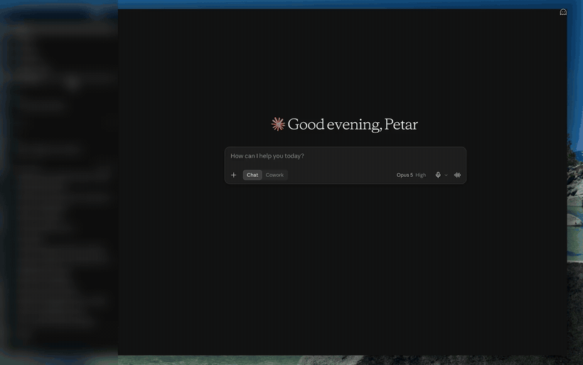
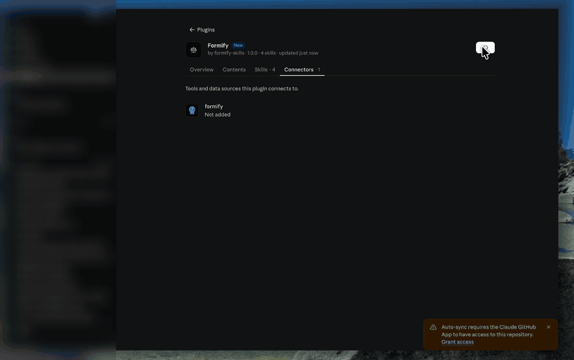
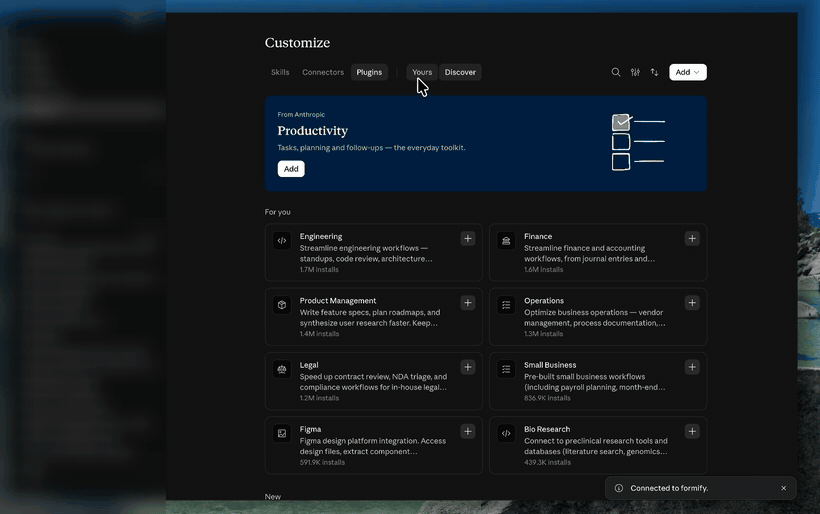
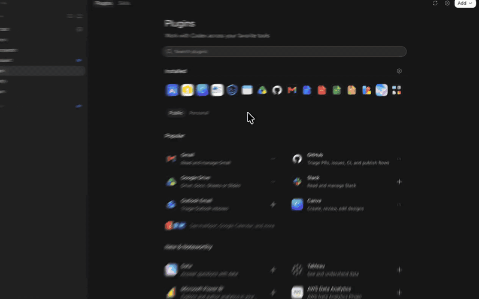

# Formify Skills

[](https://glama.ai/mcp/connectors/eu.formify.mcp/formify) [](https://smithery.ai/server/formify-e-sign/formify-mcp)

**Ask an AI assistant to get something signed, and it knows how.**

These are agent skills for [Formify](https://formify.eu) — electronic signatures and
identity verification. Install them once, and your assistant can build a contract or a
fillable form, place the signature fields where they belong, send it to the right people,
verify who signed with BankID or an ID scan, and chase the ones who have not.

You can also send an AI assistant along **inside the document itself**. The person receiving
your contract can ask it what a clause means and it highlights the passage it is answering
about, reads it aloud if they prefer, and answers in English, Swedish or Spanish — so nobody
has to paste your contract into another chatbot to understand what they are signing.

You do not need to be technical, and you never learn a command. You describe what you want
signed and by whom; everything below is what the assistant handles for you.

Works with Claude Code, Claude Desktop, Codex, ChatGPT, Grok, Manus, Cursor and around twenty
other agents.

## Contents

- [Why this exists](#why-this-exists)
- [The four skills](#the-four-skills)
- [The whole process, not one document](#the-whole-process-not-one-document)
- [What you can ask for](#what-you-can-ask-for)
- [What the agent can actually do](#what-the-agent-can-actually-do)
- [One of those, end to end](#one-of-those-end-to-end)
- [Install it in a minute](#install-it-in-a-minute) — the one-minute version for Claude
- [Install](#install) — [Start here](#start-here--one-install-everywhere-in-claude) · [If plugins are unavailable](#if-plugins-are-unavailable-to-you) · [Try it](#try-it--paste-this-into-the-chat) · [ChatGPT](#chatgpt) · [Codex](#codex) · [Grok](#grok) · [Manus](#manus) · [Claude Code](#claude-code) · [Any agent](#any-agent-via-the-skills-installer) · [In a repository](#in-a-repository-with-no-install-at-all) · [Manually](#manually-anywhere)
- [Connect the Formify MCP server](#connect-the-formify-mcp-server)
- [Coming soon: skills for your niche](#coming-soon-skills-for-your-niche)
- [What is in this repository](#what-is-in-this-repository)
- [Contributing](#contributing)
- [License](#license)

---

## Why this exists

A small business does not have a contracts department. It has one person who also does
everything else, and a folder of documents that get retyped, mis-edited and emailed around
until somebody signs a scan of a printout.

The signature was never the hard part. Everything around it is:

- The same agreement rebuilt from scratch, because last month's version is buried in an inbox
- Details typed by hand into a PDF that was never made fillable in the first place
- Three people who have to sign in a particular order, coordinated over email
- An identity or company check that legally has to happen, done informally or not at all
- A week of *"has anyone signed yet?"*, answerable only by scrolling back through mail

None of that is a signing problem. It is a **document workflow** problem, and it is where
small businesses lose their week.

These skills give an assistant the knowledge to run that workflow properly — the field
geometry, the ordering rules, the verification options, the follow-up logic — instead of
attaching a file and pressing send.

---

## The four skills

| Skill | What it does |
|---|---|
| **`formify-pdf-forms`** | Builds fillable PDF forms and contract templates: text fields, checkboxes, dropdowns, signature space, and Formify's `tink-*` markers for ID scans and company checks. |
| **`formify-send-contract`** | Sends a document for electronic signature — from a saved template, an uploaded PDF, or one drafted in the conversation. Previews where the signature will land before anyone is contacted. |
| **`formify-verify-identity`** | Verifies the person signing: Swedish BankID, ID document scan, live face check, company registration lookup, KYC. |
| **`formify-track-signatures`** | Everything after the send: who has signed, remind only the ones who have not, repair a mistyped email, hand someone a link in person, cancel, download the signed copy. |

Building and structuring a document happens in the conversation. Sending, signing and
identity checks run through your Formify account.

The `tink-*` markers a document carries are read by Formify's signing client. In any other
PDF viewer they are ordinary empty fields, so the document stays valid and usable on its own.

---

## Install it in a minute

In Claude — the desktop app, the browser, or Cowork — Formify installs as one plugin: the four
skills above and the connection to your Formify account, together.

Open **Customize → Plugins**, select **Add marketplace**, and enter:

```
formify-e-sign/formify-skills
```

Select **Sync**, then **Install** when Formify appears, and sign in to your Formify account
when it asks.



Then just describe the job — you never name a skill:

```
I'm letting out my flat in Palma to a Dutch tenant. Draft the tenancy agreement,
put signature fields on it, and show me what it looks like before anything is sent.
```

Using ChatGPT, Codex, Grok, Manus, a terminal, or a plan that blocks plugins? Every one of
those is covered under [Install](#install) further down.

---

## The whole process, not one document

Most e-signature integrations stop at *upload a PDF, add a signature box, send*. That is the
easy tenth of the job. A real document has a life around it, and an assistant carrying these
skills can run all of it:

1. **Draft** — from a saved template, an uploaded PDF, or written from scratch in the conversation
2. **Make it fillable** — text fields, checkboxes, dropdowns, with the constraints a signing client actually imposes
3. **Place the signature correctly** — signature space is not a form field, and getting that wrong is the most common way a document arrives broken
4. **Decide what must be proven** — BankID, ID document scan, live face check, company lookup, or a one-time code before the document even opens
5. **Route it** — several signers, in a set order or all at once, by email or SMS
6. **Preview** — see exactly where every field landed, before a single person is contacted
7. **Explain it, on the recipient's side** — attach an AI assistant that lives in the document, highlights the clause it is answering about, and speaks if asked
8. **Follow up** — who signed, who only opened it, who never looked; remind the ones who have not, never the ones who have
9. **Repair** — correct a mistyped address, hand someone a link in person, revoke the whole thing
10. **Hand off** — download the signed copy, or fire a webhook so the next system in your business picks it up

Ten steps. The assistant runs them because the skills describe how each one works — not
because you learned a tool name.

---

## What you can ask for

Say it the way you would say it to a colleague. You do not need to know which skill handles
it, and you never name a tool.

**You rebuild the same tenancy agreement every month**

> Take this tenancy agreement, add fields for the tenant's name, address and move-in date,
> and send it to both tenants. They sign in order — main tenant first.

**Onboarding a company client means a compliance file nobody enjoys assembling**

> New client, a limited company. I need their company details verified, the beneficial owner
> confirmed, and a KYC record I can keep. Set up the engagement letter for signature.

**One document, many recipients, and they must not see each other**

> Send this NDA to the three freelancers on this list. Same document, one each, not a group
> signing.

**The quote is written; turning it into something signable is the chore**

> Turn this quote into a contract with a deposit line and a signature block, then send it to
> the customer by SMS — I only have their mobile.

**Forty recipients and no way to tell who is missing**

> This consent form goes to forty parents. I need to know who has returned it and chase only
> the ones who have not.

**Every client emails you the same three questions before they sign**

> Send the tenancy agreement to both tenants, and turn on the in-document assistant in
> Swedish so they can ask it about the notice period instead of ringing me.

**You need the ID details but you must not keep the picture**

> Patient intake form, signed on the tablet at reception, with an ID document scanned but
> the picture not kept — only the name and document number.

That last one is a real capability most people never discover: an identity document can be
scanned and its data captured **without the image being stored at all**. Keeping a copy of
someone's passport needs its own legal basis; often the data is all you needed.

---

## What the agent can actually do

Connected to your Formify account, through the MCP server:

| | |
|---|---|
| **Documents** | Create from a template, from an uploaded PDF, or from something drafted in the conversation. Preview before anyone is contacted. Send, revoke, download the signed copy. |
| **Recipients** | Several signers, in a set order or all at once. Email or SMS. Correct a mistyped address. Hand someone a link in person. |
| **Identity** | Swedish BankID, ID document scan, live face check, company registration lookup, KYC. A one-time code before the document even opens. |
| **Inside the document** | An AI assistant that travels with the contract. The recipient asks it a question, it highlights the clause it is answering about, reads it aloud on request, and speaks English, Swedish or Spanish. |
| **Following up** | Who has signed, who has only opened it, who has not looked. Remind the ones who have not — never the ones who have. |
| **Files and templates** | Upload, merge several PDFs into one, read the fields a template expects, fill them. |
| **Automation** | Webhooks, so something else happens when a document completes. |

Everything runs with exactly the permissions your Formify account already has, and every
feature is checked against your plan before it is offered — so the agent never proposes
something your account cannot do.

---

## One of those, end to end

> **You:** Take this rental agreement and send it to Maria for signature. She needs to show
> ID first.
>
> **Agent:** Your account has ID scan enabled. I'll upload the PDF, place a signature box
> and an ID scan box at the bottom of the last page, and show you a preview before anything
> is sent to her.
>
> *(preview)*
>
> **Agent:** Maria will get an email, photograph her ID card, then sign. About two minutes.
> Send it?

Three days later:

> **You:** Has Maria signed yet?
>
> **Agent:** Not yet — sent Tuesday, opened Wednesday. Shall I send a reminder? She hasn't
> had one, so there's no cooldown.

---

## Install

Pick the row that matches how you use Formify. Most people want the first one.

| You work in… | Go to | Terminal? |
|---|---|---|
| **Claude** — Desktop, browser or Cowork | [Start here](#start-here--one-install-everywhere-in-claude) | no |
| **ChatGPT** | [ChatGPT](#chatgpt) | no |
| **Codex** | [Codex](#codex) | yes |
| **Grok** | [Grok](#grok) | no |
| **Manus** | [Manus](#manus) | no |
| Claude Code, or another coding agent | [Claude Code](#claude-code) · [Any agent](#any-agent-via-the-skills-installer) | yes |

### Start here — one install, everywhere in Claude

Formify installs as a **plugin**: the four skills and the connection to your Formify account
arrive together. This works in chat on the web, in the Chat tab of Claude Desktop, and in
Cowork. You need a paid Claude plan. There is nothing to download, no file to unzip, and no
GitHub account required.

Three steps, about a minute. Each one is shown below exactly as it looks on screen.

#### 1. Add Formify to your plugin list

In Claude, open **Customize** in the sidebar and go to **Plugins**. Select **Add** in the top
right, then **Add marketplace**, and type:

```
formify-e-sign/formify-skills
```

Claude finds the repository as you type and offers it — accept the suggestion, leave **Sync
automatically** on so you get our updates, and select **Sync**. Formify now appears in your
list with an **Add** button next to it. Select it.

*The recording of these steps is at the top of this file, under [Install it in a minute](#install-it-in-a-minute).*

*A marketplace is just an address Claude reads plugins from. Ours is a public repository, so
nothing is downloaded to your computer and every improvement we publish reaches you.*

#### 2. Connect your Formify account

The plugin is installed, but Claude still needs permission to act on your account. Open the
Formify plugin, go to the **Connectors** tab, and select **Connect**.

Your browser opens, you confirm the connection, and you choose which Formify account to use.
Claude never sees your password — you sign in to Formify, and Formify tells Claude what that
account is allowed to do. When it says **Connected**, return to the app.



*If you have several Formify accounts, the one you pick here is the one Claude will send
documents from. You can change it later from the same screen.*

#### 3. Check what you have

Open the plugin once and you can see everything it brought: the description, the categories it
is filed under, its four skills, and the Formify connector listed under **Connectors & tools**.



**What each of the four does.** The connector lets Claude act on your account — create
documents, send them, collect signatures. The skills are what make it good at the job:

| Skill | What it knows |
|---|---|
| `formify-pdf-forms` | how to build a contract or form with fillable fields and signature boxes in the right places |
| `formify-send-contract` | how to send it — from a template, an uploaded PDF, or something drafted in the conversation |
| `formify-verify-identity` | when a signature needs proof of identity, and which check to use: BankID, ID scan, face liveness |
| `formify-track-signatures` | what to do afterwards — who has not signed, reminders, a wrong email address, cancelling |

You never name a skill. Describe the job and Claude picks the right one.

**Updating.** Select **Update** on the plugin whenever you want the newest version. With
**Sync automatically** left on, Claude checks for you.

<sub>The recordings above are the real setup, with personal details blurred.</sub>

### If plugins are unavailable to you

Some plans and some organisations do not allow plugins. In that case the skills install one at
a time, by hand, and the connector separately.

**1.** **Settings → Capabilities**, and enable code execution and file creation.

**2.** Go to the [Releases page](https://github.com/formify-e-sign/formify-skills/releases) and,
on the newest release, download the four ZIP files:

| File | What it adds |
|---|---|
| `formify-pdf-forms.zip` | building forms and contracts with fillable fields |
| `formify-send-contract.zip` | sending a document for signature |
| `formify-verify-identity.zip` | BankID, ID scan, face liveness, company lookup |
| `formify-track-signatures.zip` | chasing, correcting and cancelling what you sent |

Do not unzip them — they are already in the shape Claude expects.

**3.** Open **Customize** in the sidebar, go to **Skills**, then **Create skill → Upload a
skill**, and choose one ZIP. Repeat for the other three.

**4.** Add the connector by hand: **Settings → Connectors → Add Connector**, and paste
`https://mcp.formify.eu/mcp`.

On this path nothing updates itself: when we release a new version, download the ZIPs again
and upload them over the old ones.

### Try it — paste this into the chat

You do not need to learn any commands. Describe the job and Claude picks the right skill on
its own. Copy any of these:

```
What can you do for me with Formify?
```

```
I'm letting out my flat in Palma to a Dutch tenant. Draft the tenancy agreement,
put signature fields on it, and show me what it looks like before anything is sent.
```

```
Send the contract in this PDF to anna@example.com for signature, and check her ID
with BankID before she signs.
```

```
Who still hasn't signed the contract I sent last week? Remind them.
```

### ChatGPT

**What works today:** the connector. In ChatGPT's settings, add a connector and paste:

```
https://mcp.formify.eu/mcp
```

ChatGPT can then create documents, send them for signature and check who has signed.

**What does not, yet:** the four skills. ChatGPT installs skills only from its own reviewed
directory, and Formify is not in it. So you get the actions but not the judgement — ChatGPT
will do what you ask, without knowing what a good contract looks like or where a signature
field has to sit. Claude Desktop is where you get both halves today.

### Codex

Codex has the same shape as Claude: add our repository as a marketplace, then install the
plugin. The desktop app and the CLI share one configuration, so doing it in either covers both.

**In the Codex desktop app.** Open **Plugins**, select **Add**, then **Add plugin
marketplace**, and put this in **Source**:

```
formify-e-sign/formify-skills
```

Leave **Git ref** and **Sparse paths** empty — the defaults are right for us. Select **Add
marketplace**. Formify appears in your marketplace list; install the plugin from there, and
use **Upgrade** on that row whenever you want the newest version.



**From the terminal**, the same two steps:

```bash
codex plugin marketplace add formify-e-sign/formify-skills
codex plugin add formify@formify
```

This brings the four skills and the MCP connection together. `codex plugin list` shows the
result, and `codex plugin marketplace upgrade` pulls a newer version.

### Grok

Grok takes the Formify connector directly, on every plan.

Go to **grok.com/connectors**, select **New Connector**, then **Custom**, and enter:

```
https://mcp.formify.eu/mcp
```

Complete the sign-in when it asks. Grok can then create documents, send them for signature
and tell you who has signed — on web, iOS and Android.

On a Business or Enterprise workspace a team admin has to provision the connector first.

**What you do not get this way:** the four skills. Grok's consumer app has its own skills
system that does not read a GitHub repository, so the connector gives Grok the actions
without the judgement — how a contract should read, where a signature field belongs, which
identity check a document calls for.

**Grok Build**, the CLI, is different: xAI documents that it *"automatically reads Claude
Code marketplaces, plugins, skills, MCPs, agents, hooks, and instruction files… alongside
`.grok/`."* The `.claude-plugin/` manifests in this repository are the ones it reads, so
nothing extra is needed on our side. xAI does not document the command that adds a
marketplace, so follow their instructions for that step.

### Manus

Two things, added separately.

**1. The connector.** **Settings → Integrations → Custom MCP Servers → Add Server**. Give it
a name, and for the server URL:

```
https://mcp.formify.eu/mcp
```

Complete the sign-in it asks for. Manus can now act on your Formify account.

**2. The skills.** Manus imports a skill from a GitHub repository only when `SKILL.md` sits at
the repository root, and ours live in `skills/`. So use the upload route instead: download the
four ZIPs from our [Releases page](https://github.com/formify-e-sign/formify-skills/releases),
then **Skills → + Add → Upload a Skill** and choose one. Repeat for the other three.

These are the same ZIPs described under [If plugins are unavailable to you](#if-plugins-are-unavailable-to-you)
— one skill per archive, with the skill folder as the top of the ZIP, which is the shape both
Manus and claude.ai expect.

---

**Everything above is a desktop or browser app.** If you would rather work in a terminal, or
you already use a coding agent, the same plugin installs there — and in Claude Code and Codex
CLI it is two commands rather than a dialog. The sections below are for that.

They install exactly the same four skills and the same connector. Nothing is different about
what Formify can do; only how you get it.

### Claude Code

Two steps, run one after the other — not pasted together.

Add the marketplace:

```
/plugin marketplace add formify-e-sign/formify-skills
```

Then install the plugin:

```
/plugin install formify@formify
```

Unlike the Desktop app's marketplace dialog, this takes any public repository.

### Any agent, via the skills installer

```bash
npx skills add formify-e-sign/formify-skills
```

Installs into the agent's skill directory — `.agents/skills`, which around twenty agents
read directly, with Claude Code and Eve symlinked to it.

```bash
npx skills add formify-e-sign/formify-skills --list          # see what is in here first
npx skills add formify-e-sign/formify-skills --skill formify-pdf-forms
npx skills add formify-e-sign/formify-skills -g              # global, across projects
```

**These skills contain no executable code.** Every file is Markdown or YAML — no `scripts/`,
nothing that runs. A skill is instructions an agent reads, and the usual advice to inspect
`scripts/` before installing has nothing to inspect here.

### In a repository, with no install at all

Clone the repo and the skills are already where most agents look — `.agents/skills` is a
symlink to `skills/`, which Codex, Cursor, Amp, opencode and Zed scan
automatically.

### Manually, anywhere

Copy the folders inside `skills/` into whatever directory your agent reads. Each skill is
self-contained: a `SKILL.md` and, where it needs one, a `references/` folder.

---

## Connect the Formify MCP server

Already covered in [Start here](#start-here--claude-desktop-and-claudeai) and in the Codex
and Claude Code steps — this section is the reference, and the place to look if you install
by hand.

The skills describe *how* to work with Formify. The MCP server is what actually does it —
creating documents, sending them, collecting signatures.

**Server URL:** `https://mcp.formify.eu/mcp`

**Claude (web or desktop):** Settings → Connectors → Add Connector → paste the URL. You will
be asked to log in with your Formify account.

**Claude Code:**

```bash
claude mcp add --transport http formify https://mcp.formify.eu/mcp
```

**Anything reading a plugin manifest:** the server is already declared in `mcp.json` and in
both plugin manifests, so installing the plugin offers the connection.

You authorise with your own Formify account. The skills never see your password, and every
action runs with exactly the permissions that account already has.

---


## What is in this repository

```
skills/                        the four skills — the one canonical source
  formify-pdf-forms/
  formify-send-contract/
  formify-verify-identity/
  formify-track-signatures/
.agents/skills -> skills       symlink; most agents find the skills with no install
plugin.json  mcp.json          Agent Plugins 1.0.0
.mcp.json                      the MCP server, referenced by the manifests below
.claude-plugin/                Claude Code plugin and marketplace entry
.codex-plugin/                 Codex CLI plugin, with the marketplace listing block
.agents/plugins/               Codex and ChatGPT marketplace catalogue
package.json  skills.sh.json   npm, npx, and the skills.sh gallery
scripts/check-manifests.mjs    keeps the manifests from drifting apart
tests/release/                 what the skills do, not just what they say
```

Every manifest describes the same `skills/` directory. Nothing is copied, so no adapter can
drift from the source — and `npm run check` proves it, in CI on every push.

Every statement these skills make about the Formify API was checked against the server
before it shipped. Four hundred and fifty-one claims inherited from the previous generation
of these skills were re-verified one at a time; the ones that turned out to be wrong were
corrected here rather than carried forward, and the ones that could not be settled were
removed rather than repeated.

`tests/release/` checks behaviour rather than structure, and two details are the reason
it exists. References are re-checked **inside an actually extracted npm tarball** rather
than in the working tree, because a path that resolves in the repository and is missing
from the published package is a defect nobody sees until a stranger installs it. And the
routing cases score an **accepted set** of skills per request rather than one correct
answer, because a request can legitimately be served two ways and a test that insists
otherwise measures the test author, not the skills.

Sixteen requests across English, Swedish and Spanish cover activation, overlap and the
negative cases where no skill should fire. The workflow cases run against a synthetic MCP
server with no network and no credentials, so a send that should have been blocked fails
because there is nothing to send with. The suite's own README states its limits: it is a
description-routing proxy, not proof of native discovery, and it establishes nothing about
the live service.

The shape of the skills comes from the same exercise. Fifty-nine real user situations were
mapped against what the platform can actually do, and eight of them were served by no skill
at all — every one of those happening *after* a document is sent. That is why
`formify-track-signatures` exists, and why there are four skills here rather than two.

---

## Contributing

Issues and pull requests are welcome. Two rules keep the skills trustworthy:

1. **A claim about the Formify API is verified against the server, or it does not ship.**
   Cite what you checked.
2. **No skill may depend on a mechanism that exists in only one agent runtime.** Where a
   harness offers something better, it is an optional enhancement with a stated fallback.

### Cutting a release

Clients decide whether to update by comparing version numbers, not content. A
changed skill with an unchanged version reaches nobody except people who cloned the
repo. So every change that ships is a version bump, and one script writes all ten
places the version lives:

```bash
npm run release 1.1.0       # six manifests and four skill frontmatters
npm run check
git commit -am "release 1.1.0" && git tag v1.1.0 && git push --follow-tags
```

`npm run release --check` is part of `npm run check` and runs in CI, so drift fails
the build. `--audit` lists files carrying the version that `.version-bump.json` does
not declare — a file added later that needs adding there. Publishing happens on the
`v*` tag alone, and refuses if the tag and the manifests disagree.

### Directory listings are not automatic

Two directories carry this project as a live product surface rather than a passive index,
and they are addressed per skill, so adding, renaming or materially changing a skill means
updating them by hand:

| Where | What is listed |
|---|---|
| [Smithery](https://smithery.ai/server/formify-e-sign/formify-mcp) | The MCP server, plus each skill separately at `smithery.ai/skills/formify-e-sign/<skill>` |
| [Glama](https://glama.ai/mcp/connectors/eu.formify.mcp/formify) | The MCP server |

The Anthropic plugin directory is the exception — it re-reads GitHub on every push, so it
needs nothing. Everywhere else, a release that changes the skill set is only half shipped
until the listings match it.

---

## License

MIT. See [LICENSE](LICENSE).
